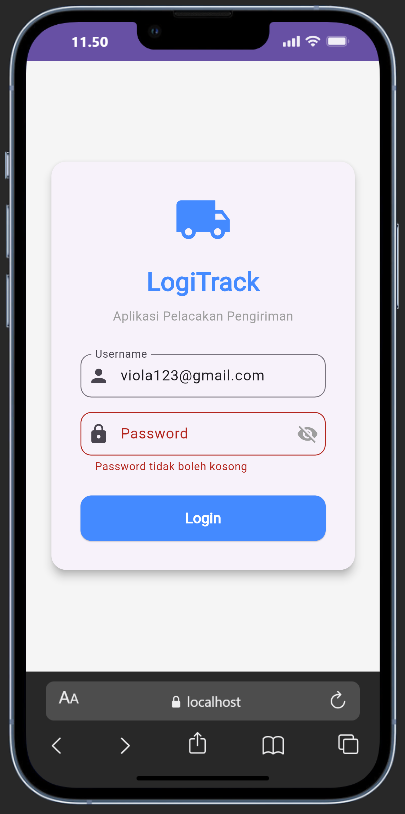

# LogiTrack - Aplikasi Monitoring Pengiriman (UTS Pemrograman IV)

Aplikasi ini dibuat untuk memenuhi tugas **Asesmen Tengah Semester (UTS)** mata kuliah Pemrograman IV. Dibangun menggunakan **Flutter**, aplikasi ini mensimulasikan sistem pelacakan paket sederhana dengan fitur Login dan Dashboard pengiriman yang dinamis.

---

## 📋 Fitur & Pengerjaan Soal

| No | Soal | Deskripsi |
|----|------|-----------|
| 1 | **Desain UI Item Pengiriman** | Menampilkan kartu pengiriman menggunakan widget `Card` dan `ListTile`. |
| 2 | **Manajemen Data / Model** | Membuat class `DeliveryTask` dengan `fromJson()` untuk membaca data dari JSON. |
| 3 | **Halaman Login & Validasi** | Form login dengan validasi: password tidak boleh kosong dan minimal 6 karakter. Ada tombol show/hide password. |
| 4 | **Menampilkan Data Dinamis** | Memakai `FutureBuilder` untuk menangani 3 kondisi tampilan: loading, error, dan data berhasil dimuat. |
| 5 | **Integrasi Mock API** | Mengambil data dari API publik secara asinkron menggunakan `http` package. |

---

## 📂 Struktur Folder

Berikut struktur folder `lib/` beserta penjelasan singkat tiap file:

```
lib/
├── main.dart                        # Titik awal aplikasi, mengatur tema dan membuka halaman Login.
├── models/
│   ├── delivery_task.dart           # (Soal 2) Model data pengiriman dari API — bisa parsing JSON.
│   └── pengiriman.dart              # Model data pengiriman untuk tampilan kartu di UI.
├── pages/
│   ├── login_page.dart              # (Soal 3) Halaman Login dengan validasi form dan toggle password.
│   └── dashboard_page.dart         # (Soal 4 & 5) Halaman Dashboard — menampilkan data dari API menggunakan FutureBuilder.
└── widgets/
    └── pengiriman_card.dart         # (Soal 1) Kartu pengiriman (Card + ListTile) dengan badge status berwarna.
```

---

## 📝 Penjelasan File

### `main.dart`
File utama yang pertama kali dijalankan saat aplikasi dibuka.

- Mengatur tema warna aplikasi (biru, Material Design 3).
- Menentukan halaman pertama yang ditampilkan adalah `LoginPage`.
- Mendaftarkan route `/dashboard` agar bisa berpindah ke halaman Dashboard setelah login.

---

### `models/delivery_task.dart`
Class yang menyimpan data satu tugas pengiriman yang didapat dari API.

| Properti | Tipe | Keterangan |
|----------|------|------------|
| `id` | `int` | Nomor unik pengiriman |
| `resi` | `String` | Nomor resi, contoh: `INV-0001` |
| `penerima` | `String` | Nama penerima barang |
| `isDelivered` | `bool` | `true` = sudah terkirim, `false` = masih dalam proses |

- `fromJson()` — mengubah data JSON dari API menjadi objek Dart.
- `toJson()` — mengubah objek kembali ke format JSON.

---

### `models/pengiriman.dart`
Class sederhana untuk menyimpan data pengiriman yang ditampilkan di kartu UI.

| Properti | Tipe | Keterangan |
|----------|------|------------|
| `nomorResi` | `String` | Nomor resi, contoh: `INV-2024001` |
| `tujuanPengiriman` | `String` | Alamat tujuan pengiriman |
| `statusPengiriman` | `String` | Status: `proses`, `dikirim`, atau `gagal` |

---

### `pages/login_page.dart`
Halaman pertama yang dilihat pengguna sebelum masuk ke Dashboard.

- Terdapat form input **Username** dan **Password**.
- Validasi form: username tidak boleh kosong, password tidak boleh kosong dan minimal 6 karakter.
- Ada tombol ikon mata untuk menampilkan atau menyembunyikan password.
- Setelah login berhasil, aplikasi pindah ke Dashboard dan halaman login tidak bisa dibuka lagi dengan tombol back.

---

### `pages/dashboard_page.dart`
Halaman utama yang menampilkan daftar pengiriman setelah pengguna berhasil login.

- Menggunakan `FutureBuilder` untuk menampilkan 3 kondisi berbeda:

  | Kondisi | Yang Ditampilkan |
  |---------|-----------------|
  | Sedang loading | Animasi loading (spinner) |
  | Gagal memuat | Pesan error + tombol **Coba Lagi** |
  | Data berhasil dimuat | Daftar kartu pengiriman |

- Data diambil dari [JSONPlaceholder API](https://jsonplaceholder.typicode.com/todos?_limit=10) — API publik gratis yang digunakan sebagai simulasi.
- Jika gagal, pengguna bisa menekan tombol **Coba Lagi** untuk memuat ulang data.

---

### `widgets/pengiriman_card.dart`
Widget kartu yang digunakan untuk menampilkan satu item pengiriman dalam daftar.

| Bagian Kartu | Isi |
|-------------|-----|
| Ikon kiri | Ikon truk pengiriman |
| Judul | Nomor resi pengiriman |
| Subjudul | Nama penerima |
| Badge kanan | Status pengiriman berwarna |

Warna badge menyesuaikan status:
- `proses` → Biru
- `dikirim` → Hijau
- `gagal` → Merah

---

## 📸 Screenshot Aplikasi

### 1. Halaman Login — Validasi Form (Soal 3)
> Saat tombol **Login** ditekan tanpa mengisi password, muncul pesan `"Password tidak boleh kosong"`. Tersedia juga tombol ikon mata untuk melihat/menyembunyikan password.



---

### 2. Halaman Dashboard — Daftar Pengiriman (Soal 1, 4 & 5)
> Setelah login berhasil, aplikasi menampilkan daftar pengiriman yang diambil dari API. Setiap kartu menampilkan nomor resi, nama penerima, dan badge status berwarna.


---

## 🛠️ Teknologi yang Digunakan

- **Flutter** — Framework untuk membangun tampilan aplikasi
- **Dart** — Bahasa pemrograman
- **http** package — Untuk mengambil data dari REST API
- **JSONPlaceholder** — API publik gratis sebagai simulasi data pengiriman

---

## 🚀 Cara Menjalankan Aplikasi

```bash
# Install dependencies
flutter pub get

# Jalankan aplikasi
flutter run
```

| No | Soal | Deskripsi |
|----|------|-----------|
| 1 | **Desain UI Item Pengiriman** | Menggunakan widget `Card` dan `ListTile` untuk menampilkan informasi resi, penerima, dan status. |
| 2 | **Manajemen Data / Model** | Implementasi class `DeliveryTask` dengan factory method untuk parsing JSON. |
| 3 | **Halaman Login & Validasi** | Validasi password (tidak boleh kosong & minimal 6 karakter). Fitur toggle visibility (sembunyikan/lihat) password. |
| 4 | **Menampilkan Data Dinamis** | Menggunakan `FutureBuilder` untuk menangani state: loading, error, dan hasData. |
| 5 | **Integrasi Mock API** | Simulasi pengambilan data asinkron (`async`) dengan delay 2 detik. |

---

## 📂 Struktur Folder & Penjelasan File

Berikut adalah struktur folder dalam `lib/` beserta fungsi masing-masing file:

```
lib/
├── main.dart                        # Entry point aplikasi, mengatur tema dan menjalankan LoginPage pertama kali.
├── models/
│   ├── delivery_task.dart           # (Soal 2) Model data DeliveryTask dari JSON API (factory fromJson, toJson).
│   └── pengiriman.dart              # Model data Pengiriman untuk tampilan kartu UI (nomorResi, tujuan, status).
├── pages/
│   ├── login_page.dart              # (Soal 3) Halaman Login dengan validasi form dan toggle visibility password.
│   └── dashboard_page.dart         # (Soal 4 & 5) Halaman utama yang menampilkan daftar pengiriman via FutureBuilder & HTTP API.
└── widgets/
    └── pengiriman_card.dart         # (Soal 1) Widget Card + ListTile untuk menampilkan satu item pengiriman dengan badge status.
```

---

### 📄 `main.dart`
**Entry point** dari aplikasi LogiTrack.

- Mendefinisikan `LogiTrackApp` sebagai root widget (`MaterialApp`).
- Mengatur tema warna utama aplikasi (`Colors.blue`, Material Design 3).
- Menetapkan `LoginPage` sebagai halaman awal (`home`).
- Mendaftarkan named route `/dashboard` yang mengarah ke `DashboardPage`.

---

### 📁 `models/`

Folder ini menyimpan semua **class model** (representasi data) yang digunakan di seluruh aplikasi.

#### `delivery_task.dart`
Model utama yang merepresentasikan **satu tugas pengiriman dari REST API**.

| Properti | Tipe | Keterangan |
|----------|------|------------|
| `id` | `int` | ID unik tugas pengiriman |
| `resi` | `String` | Nomor resi pengiriman (contoh: `INV-0001`) |
| `penerima` | `String` | Nama penerima barang |
| `isDelivered` | `bool` | Status: `true` = terkirim, `false` = dalam proses |

Fitur kelas ini:
- **`factory DeliveryTask.fromJson()`** — men-*parsing* data JSON dari API menjadi objek Dart.
- **`toJson()`** — mengubah objek kembali menjadi `Map` (untuk dikirim ke server).
- **`toString()`** — untuk kemudahan debugging.

> Berkaitan dengan: **Soal 2 (Manajemen Data / Model)**

---

#### `pengiriman.dart`
Model sederhana yang merepresentasikan **tampilan satu data pengiriman** di UI.

| Properti | Tipe | Keterangan |
|----------|------|------------|
| `nomorResi` | `String` | Nomor resi, contoh: `INV-2024001` |
| `tujuanPengiriman` | `String` | Alamat lengkap tujuan |
| `statusPengiriman` | `String` | Status: `proses`, `dikirim`, atau `gagal` |

Digunakan oleh widget `PengirimanCard` untuk menampilkan data pengiriman statis di UI.

---

### 📁 `pages/`

Folder ini menyimpan semua **halaman (screen)** utama aplikasi.

#### `login_page.dart`
Halaman login yang menjadi **pintu masuk** aplikasi sebelum mengakses dashboard.

Fitur yang diimplementasikan:
- **Form validasi** menggunakan `GlobalKey<FormState>`:
  - Username tidak boleh kosong.
  - Password tidak boleh kosong **dan** minimal 6 karakter.
- **Toggle visibility password** — tombol ikon mata untuk menampilkan/menyembunyikan password (`_isObscure`).
- **Loading indicator** — menampilkan `CircularProgressIndicator` saat proses login berlangsung (simulasi delay 2 detik).
- **Navigasi** — setelah login berhasil, menggunakan `Navigator.pushReplacementNamed('/dashboard')` agar pengguna tidak bisa kembali ke halaman login.

> Berkaitan dengan: **Soal 3 (Halaman Login & Validasi)**

---

#### `dashboard_page.dart`
Halaman utama yang menampilkan **daftar pengiriman secara dinamis** dari REST API.

Fitur yang diimplementasikan:
- Menggunakan `StatefulWidget` dengan `FutureBuilder` untuk menangani 3 kondisi state:

  | Kondisi | Tampilan |
  |---------|----------|
  | `waiting` | `CircularProgressIndicator` (loading) |
  | `error` | Pesan error beserta tombol **Coba Lagi** |
  | `hasData` | `ListView` berisi daftar kartu pengiriman |

- **Fungsi `fetchDeliveryTasks()`** — mengirim HTTP GET request ke [JSONPlaceholder API](https://jsonplaceholder.typicode.com/todos?_limit=10) (mock API publik), mem-parsing response JSON, dan memetakan data ke objek `DeliveryTask`.
- **Fungsi `_retryFetch()`** — me-reset `Future` agar pengguna dapat mencoba ulang saat terjadi error.
- Terdapat fitur timeout 10 detik pada setiap request.

> Berkaitan dengan: **Soal 4 (FutureBuilder)** dan **Soal 5 (Integrasi Mock API)**

---

### 📁 `widgets/`

Folder ini menyimpan **widget kustom** yang bisa dipakai ulang (*reusable*) di berbagai halaman.

#### `pengiriman_card.dart`
Widget `StatelessWidget` yang menampilkan **satu kartu pengiriman** dengan menggunakan `Card` dan `ListTile`.

Struktur tampilan kartu:

| Bagian | Widget | Isi |
|--------|--------|-----|
| `leading` | `Icon` | Ikon truk pengiriman (`Icons.local_shipping`) |
| `title` | `Text` | Nomor resi pengiriman |
| `subtitle` | `Text` | Alamat tujuan (dipotong jika terlalu panjang) |
| `trailing` | `Container` | Badge status berwarna (proses/dikirim/gagal) |

- Fungsi `_getStatusColor()` mengembalikan warna berbeda sesuai status:
  - `proses` → Biru
  - `dikirim` → Hijau
  - `gagal` → Merah

> Berkaitan dengan: **Soal 1 (Desain UI Item Pengiriman)**

---

## 📸 Screenshot Aplikasi

### 1. Halaman Login — Validasi Form (Soal 3)
> Tampilan form login ketika pengguna menekan tombol **Login** tanpa mengisi password. Muncul pesan validasi `"Password tidak boleh kosong"` di bawah field password. Terdapat juga ikon mata (👁️) untuk toggle show/hide password.


---

### 2. Halaman Dashboard — Daftar Pengiriman (Soal 1, 4 & 5)
> Tampilan halaman utama setelah login berhasil. Data pengiriman berhasil dimuat dari API secara asinkron menggunakan `FutureBuilder`. Setiap item menampilkan nomor resi (`INV-0001` dst.), nama penerima, dan badge status berwarna (`Proses` = biru, `Dikirim` = hijau).


---

## 🛠️ Teknologi yang Digunakan

- **Flutter** — Framework UI utama
- **Dart** — Bahasa pemrograman
- **http** package — Untuk HTTP request ke REST API
- **JSONPlaceholder** — Mock REST API publik untuk simulasi data pengiriman

---

## 🚀 Cara Menjalankan Aplikasi

```bash
# Install dependencies
flutter pub get

# Jalankan aplikasi
flutter run
```
